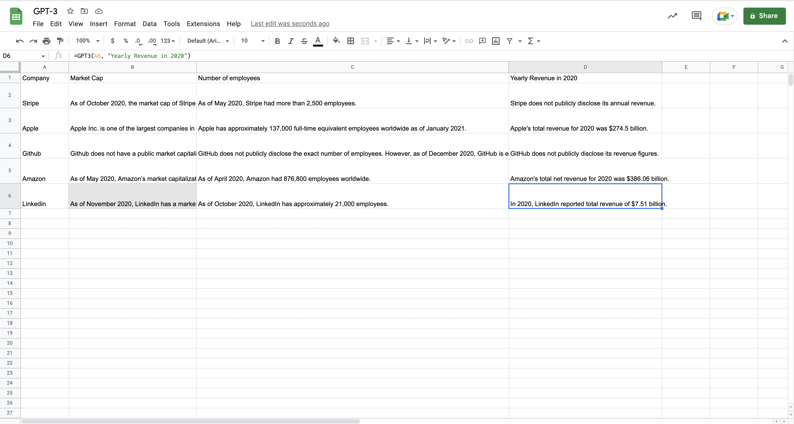

# GPT-3 Google Sheets Script
## Simple Google Sheets script for GPT-3

### Setup
1. Open your google sheet
2. Navigate to Extensions > Apps Script
3. Paste in the script located in the file `script.js`
4. Replace `<OPENAI_API_KEY>` with your open-ai api key

### Usage
To use this simple GPT3 app script call the following function in your spreadsheet
```
GPT3(arg1, arg2, ...)
```

### Example

For this example we can assume cell `C4=2` and cell `D4=4` in the spreadsheet.

Spreadsheet function call
```
=GPT3("add", C4, "and", D4, "together")
```

Output
```
6
```




